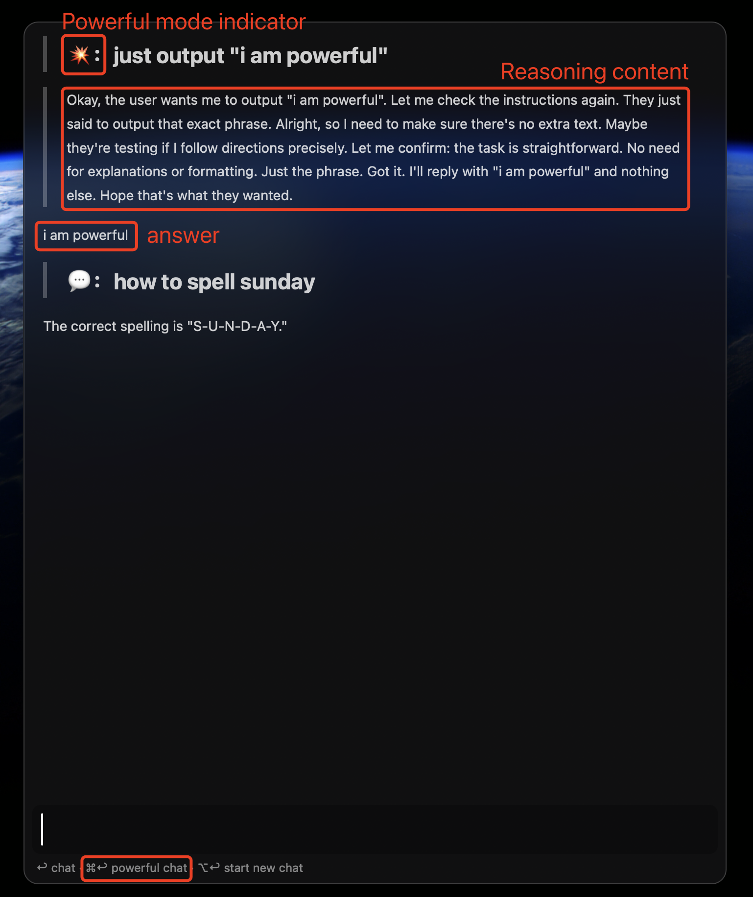
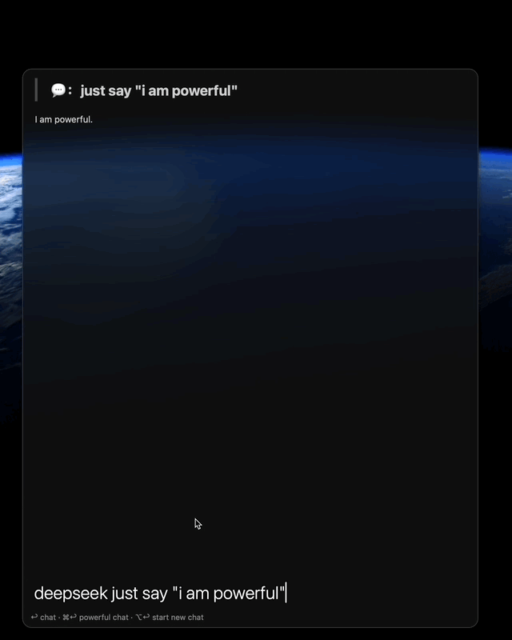
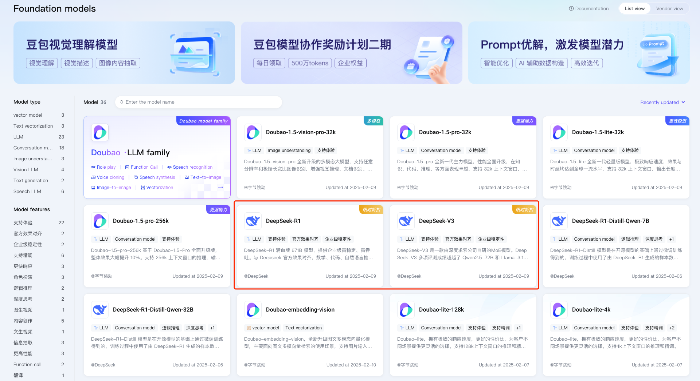
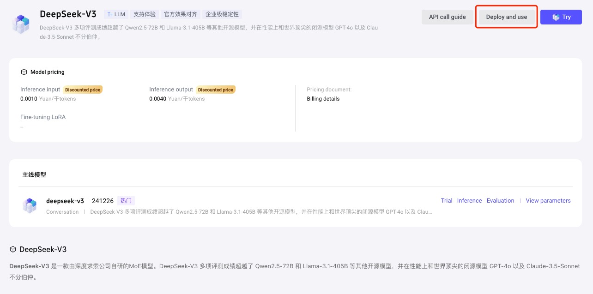
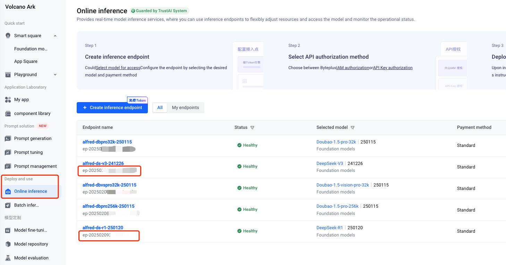
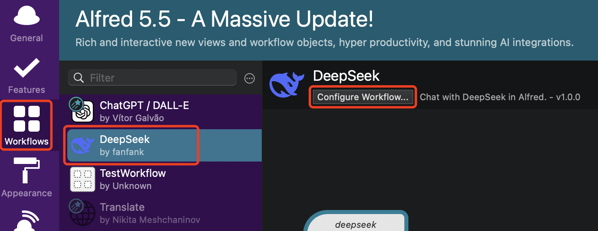
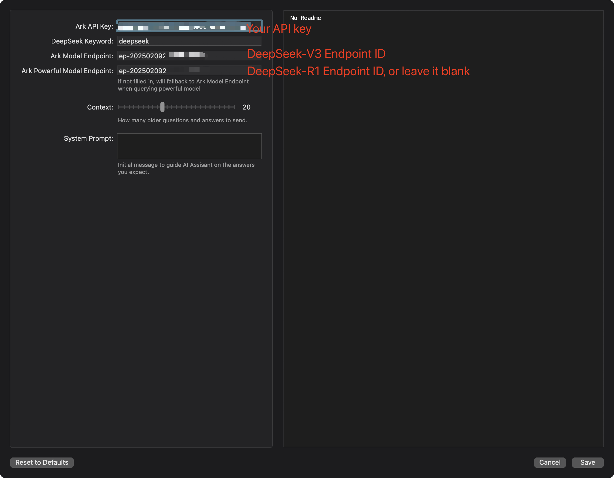
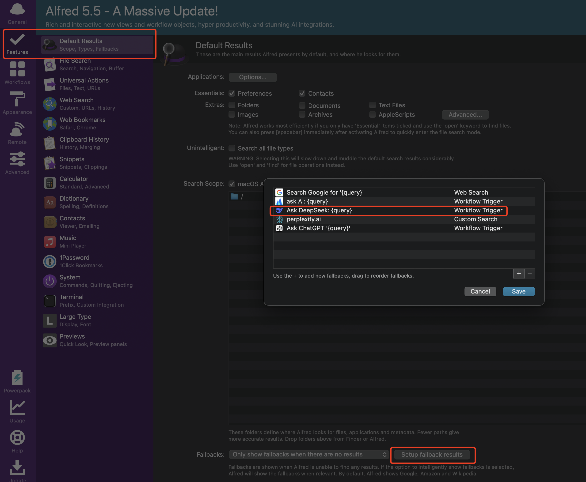
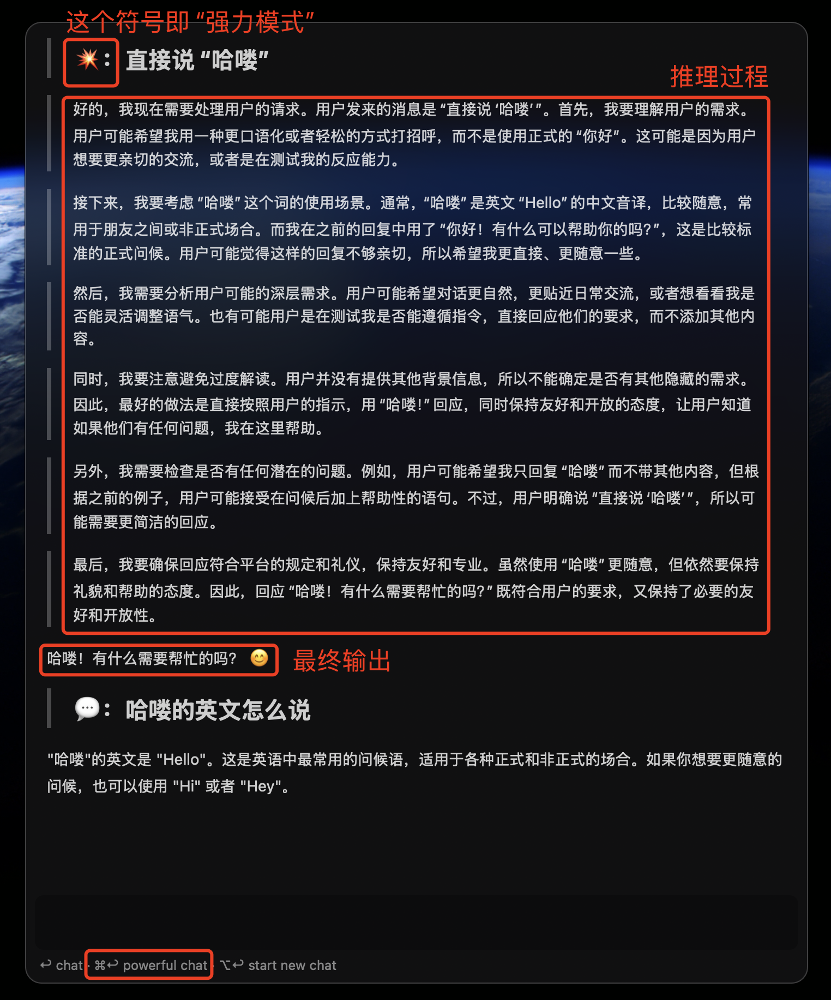

### 💡Features
* Use keyword or fallback search to chat with DeepSeek in alfred:

* Use powerful mode(<kbd>⌘</kbd><kbd>↩&#xFE0E;</kbd>) to chat:

* Display reasoning content, if available.

### 📝 Prerequisites
Currently DeepSeek official site's quota is limited, so we need to activate the model via volcengine.
1. Go to https://www.volcengine.com/ , create an account and login:
2. Create a new api key, you can refer to this page https://www.volcengine.com/docs/82379/1399008;
3. Create DeepSeek model endpoints via this page https://console.volcengine.com/ark, say DeepSeek-V3 and DeepSeek-R1:

4. Then click into the model page and click "Deploy and use" button, follow the instructions until finish activating models and creating endpoints:

5. Get model endpoints from the following page: https://console.volcengine.com/ark

### 📦 Installation
Just double click the artifact named `DeepSeek_by_fanfank_xxxx.alfredworkflow` to install.  

### 🔧 Configuration:  
Configure the workflow and you are ready to go. 🚀 

  
Don't forget to add DeepSeek to fallback search!

__NOTE: this project is based on [openai-workflow](https://github.com/alfredapp/openai-workflow) and modified by fanfank, additional features are added, like reasoning content displaying and switching between models, etc.__ 

---

### 💡特性
* 使用关键词或默认搜索与 DeepSeek 聊天：

* 使用强力模式(<kbd>⌘</kbd><kbd>↩&#xFE0E;</kbd>)聊天：

* 能显示出推理内容，如果有的话。

### 📝 前提条件
目前 DeepSeek 官方网站 OpenAPI 没法充值了，因此我们通过火山引擎来使用 DeepSeek 的模型。
1. 前往 https://www.volcengine.com/ ，创建一个账户并登录；
2. 创建一个新的 API 密钥，可以参考页面 https://www.volcengine.com/docs/82379/1399008；
3. 在 https://console.volcengine.com/ark 页面创建 DeepSeek 模型 Endpoints，例如 DeepSeek-V3 和 DeepSeek-R1：

4. 点击进入模型页面并点击"模型推理"按钮，按照指示完成模型激活和 Endpoint 创建：

5. 从以下页面查看模型 Endpoint：https://console.volcengine.com/ark

### 📦 安装
双击`DeepSeek_by_fanfank_xxxx.alfredworkflow`文件即可完成安装。

### 🔧 配置
配置 Workflow，然后就可以开始聊天了。🚀 

不要忘记添加 DeepSeek 到默认搜索！

__NOTE: 本项目基于 [openai-workflow](https://github.com/alfredapp/openai-workflow) 修改，添加了推理内容显示和模型切换等功能。__ 