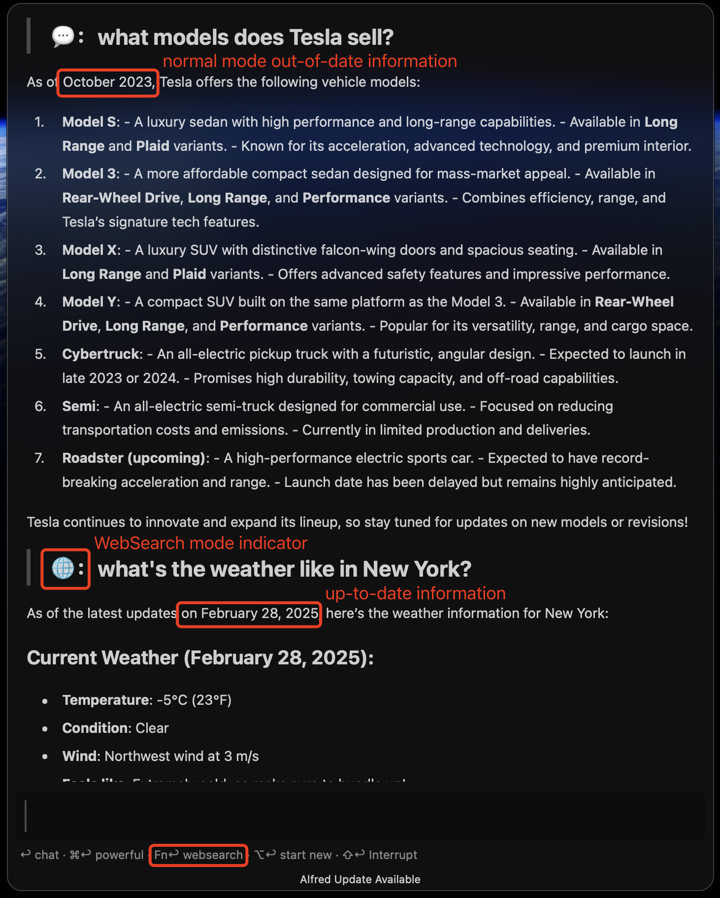
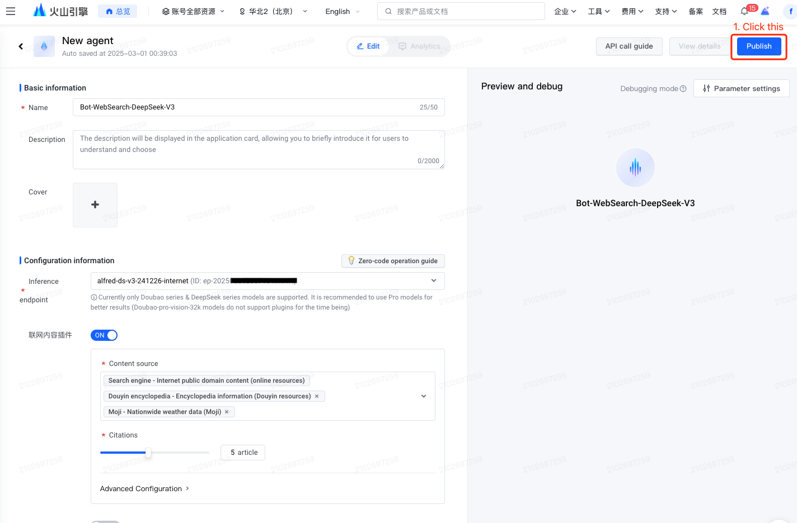
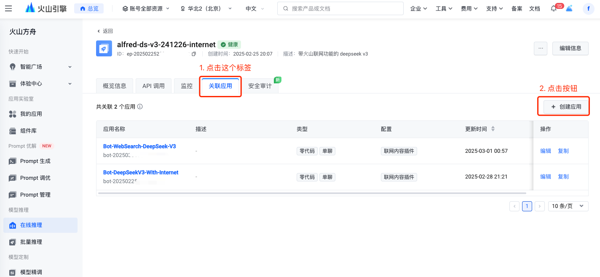

### 💡Features
* Use keyword or fallback search to chat with DeepSeek in alfred:

* Use websearch mode(<kbd>Fn</kbd><kbd>↩&#xFE0E;</kbd>) to get up-to-date information:

* Use powerful mode(<kbd>⌘</kbd><kbd>↩&#xFE0E;</kbd>) to chat:

* Display reasoning content, if available.

* Interrupted answer will be preserved in the chat history followed by "[Answer Interrupted]".

* Support the following providers:
| Providers | Normal Model | Powerful Mode | Web Search Mode |
| ------- | :-------: | :-------: | :-------: |
| [DeepSeek](https://www.deepseek.com/) | ✅ | ✅ | ⛔️ |
| [Volcengine-Ark](https://www.volcengine.com/) | ✅ | ✅ | ✅ |
| [OpenRouter](https://openrouter.ai/)| ✅ | ✅ | ✅ |

### 📝 Prerequisites
You can use alfred-deepseek with one of these providers: DeepSeek official, OpenRouter.ai or Volcengine Ark.
Currently Volcengine Ark's DeepSeek API's responding speed is much faster, and Volcengine Ark / OpenRouter.ai supports websearch mode while DeepSeek official does not.
If you want to use DeepSeek via Volcengine Ark, please follow the steps below:
1. Go to https://www.volcengine.com/ , create an account and login:
2. Create a new api key, you can refer to this page https://www.volcengine.com/docs/82379/1399008;
3. Create DeepSeek model endpoints via this page https://console.volcengine.com/ark, say DeepSeek-V3 and DeepSeek-R1:

4. Then click into the model page and click "Deploy and use" button, follow the instructions until finish activating models and creating endpoints:

5. Get model endpoints from the following page: https://console.volcengine.com/ark

6. Ensure you are using Alfred 5.5 or later.

### 📦 Installation
Just double click the artifact named `DeepSeek_by_fanfank_xxxx.alfredworkflow` to install.  

### 🔧 Configuration:  
Configure the workflow and you are ready to go. 🚀 

  
Don't forget to add DeepSeek to fallback search!

If you want to use WebSearch mode via OpenRouter.ai, just follow the instructions [here](https://openrouter.ai/docs/features/web-search), or use perplexity models [here](https://openrouter.ai/models?q=perplexity).

If you want to use WebSearch mode via Volcengine Ark, follow the steps below:
1. Activate ark web search plugin via this page: https://console.volcengine.com/common-buy/CC_content_plugin
2. Click into the model you want to use web search plugin with:

3. Create an app associated with the model:

4. Choose Zero-code mode and One-to-one Chat mode:

5. Configure your bot as follows:

6. Click "Publish" on the upper right corner:

7. Copy bot's endpoint ID and fill into the workflow's configuation page:

### 🔍 Troubleshooting
1. If you encounter the error "Task not found ......", just click "Automation Task" icon and follow the instructions to install it.

__NOTE: this project is based on [openai-workflow](https://github.com/alfredapp/openai-workflow) and modified by fanfank, additional features are added, like reasoning content displaying and switching between models, etc.__ 

---

### 💡特性
* 使用关键词或默认搜索与 DeepSeek 聊天：

* 使用网页搜索模式（<kbd>Fn</kbd><kbd>↩&#xFE0E;</kbd>)获取最新信息：

* 使用强力模式(<kbd>⌘</kbd><kbd>↩&#xFE0E;</kbd>)聊天：

* 能显示出推理内容，如果有的话。

* 中断的回答会保留在聊天历史中，并附上"[Answer Interrupted]"。

* 支持以下服务提供商：
| 模型供应商 | 普通模式 | 强力模式 | 联网模式 |
| ------- | :-------: | :-------: | :-------: |
| [DeepSeek](https://www.deepseek.com/) | ✅ | ✅ | ⛔️ |
| [火山引擎-方舟](https://www.volcengine.com/) | ✅ | ✅ | ✅ |
| [OpenRouter](https://openrouter.ai/)| ✅ | ✅ | ✅ |

### 📝 前提条件
alfred-deepseek 可以配置以下三个模型供应商的其中一个：DeepSeek 官方、OpenRouter.ai 或火山方舟。
当前火山方舟的 DeepSeek 响应速度快很多，而且火山方舟、OpenRouter.ai 支持联网搜索能力，而 DeepSeek 官方还没开放联网搜索 API。
如果你想通过火山方舟来使用 DeepSeek，则按以下步骤操作：
1. 前往 https://www.volcengine.com/ ，创建一个账户并登录；
2. 创建一个新的 API 密钥，可以参考页面 https://www.volcengine.com/docs/82379/1399008；
3. 在 https://console.volcengine.com/ark 页面创建 DeepSeek 模型 Endpoints，例如 DeepSeek-V3 和 DeepSeek-R1：

4. 点击进入模型页面并点击"模型推理"按钮，按照指示完成模型激活和 Endpoint 创建：

5. 从以下页面查看模型 Endpoint：https://console.volcengine.com/ark

6. 确保你使用的是 Alfred 5.5 或更高版本。

### 📦 安装
双击`DeepSeek_by_fanfank_xxxx.alfredworkflow`文件即可完成安装。

### 🔧 配置
配置 Workflow，然后就可以开始聊天了。🚀 

不要忘记添加 DeepSeek 到默认搜索！

如果想通过 OpenRouter.ai 使用网页搜索模式，那么可以按照官方的[这个指引](https://openrouter.ai/docs/features/web-search)，或者直接[在这里选择 Perplexity 模型](https://openrouter.ai/models?q=perplexity)。

如果想通过火山方舟来使用网页搜索模式，需要按照以下步骤进行配置：
1. 通过这个地址开通联网插件：https://console.volcengine.com/common-buy/CC_content_plugin
2. 点击你想要使用联网插件的模型：

3. 创建一个与模型关联的应用：

4. 选择零代码模式和一对一聊天应用：

5. 配置你的 bot，如下：

6. 点击右上角的"发布"按钮：

7. 复制 Bot 的 endpoint ID，并将其填写到配置页面中：

### 🔍 故障排除
1. 如果无法正常执行，且在 debug 日志中看到 "Task not found ......" 错误，只需点击 "Automation Task" 图标并按照提示安装即可。

__NOTE: 本项目基于 [openai-workflow](https://github.com/alfredapp/openai-workflow) 修改，添加了推理内容显示和模型切换等功能。__ 